<p align="center" width="100%">
    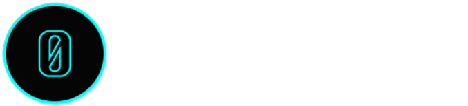
</p>

🚧 Under construction 🚧
## Market gm ☕️ - An NFT marketplace 

> 0.5% platform fee & [EIP-2981](https://eips.ethereum.org/EIPS/eip-2981) royalties honored, filetype flexibility, auto-generated IPFS site, and fully customizable.


1. **Overview:** A tour of the marketplace.
2. **Mobile Devices:** How to use Market gm as a progressive web application.
2. **Guide:** How to create & cancel listings, create & close auctions, create an offer and Buy.
3. **Proposed Metadata Structures:** Additional meta data feature for rendinging non-image filetypes.
4. **goerli-market**: Overview of the goerli-market.
5. **Maretplace Source Code:** Overview of the marketplace source code.
6. **More Info:** FAQs, APIs, and links.


# Overview

>   
> "Speak fren and enter." - Gandalf 🧙🏼‍♂️
>   
> Mint a Zero Being here [mint.zerobeings.xyz](https://mint.zerobeings.xyz)
>   

Market gm is an NFT gated marketplace. The connecting wallet must have a balance of at least one Zero Being NFT.
Wallet authorization is accomplished with [PrivateParty](https://privateparty.dev).

> Private Party is a dead simple blockchain auth framework created by [skogard](https://twitter.com/skogard)

<p align="center" width="100%">
    
</p>

To access Market gm ☕️ head over to [gm.zerobeings.xyz](https://gm.zerobeings.xyz) and login.

<p align="center" width="100%">
    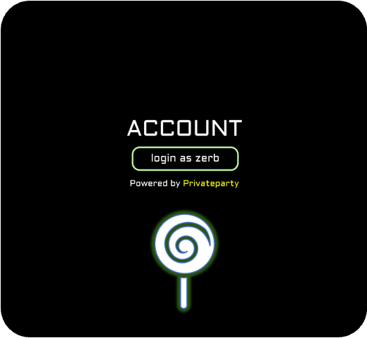
</p>

After logging into Zerb gm ☕️, open the menu on the left.

<p align="center" width="100%">
    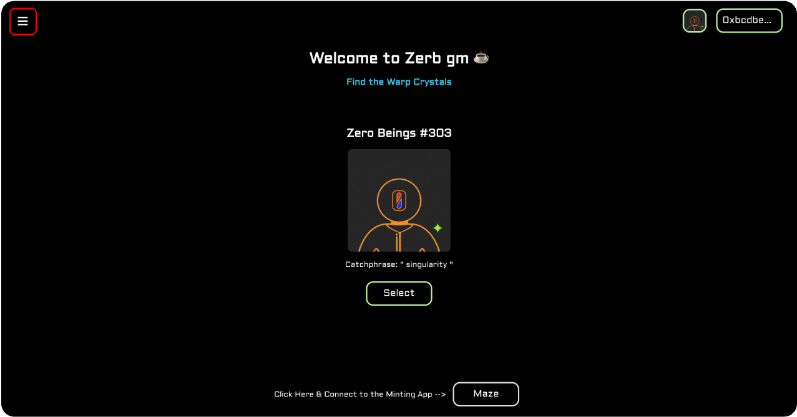
</p>

Click on goerli-market or Market gm ☕️.

<p align="center" width="100%">
    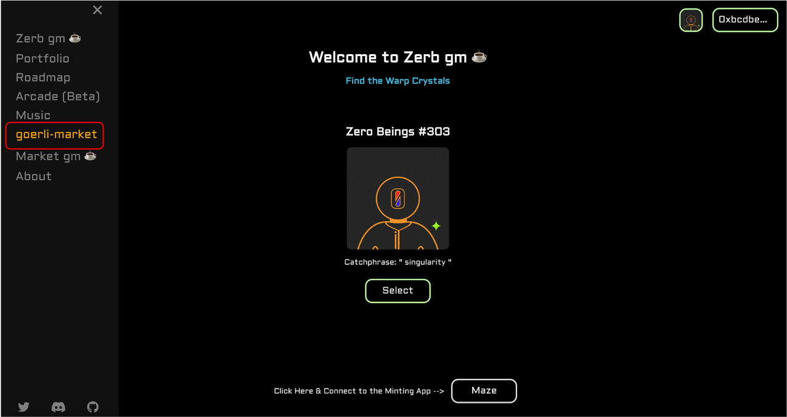
</p>

goerli-market will load the goerli marketplace for testing collection launches and rendering various filetypes.

> Filetypes currently supported are as follows: .png, .svg, .jpg, .jpeg, .gif, .wav, .mp3, .ogg, .mp4, .webm, .doc, .docx, .pdf, and .txt.

After clicking on the preferred market (goerli or mainnet) the market view will display the following. The market is automatically rendered with the Zero Beings NFT collection.

> [factoria](https://docs.factoria.app/#/),  created by [skogard](https://twitter.com/skogard), is a simple cost effective tool to launch your NFT collection.

## Market gm view - mainnet

<p align="center" width="100%">
    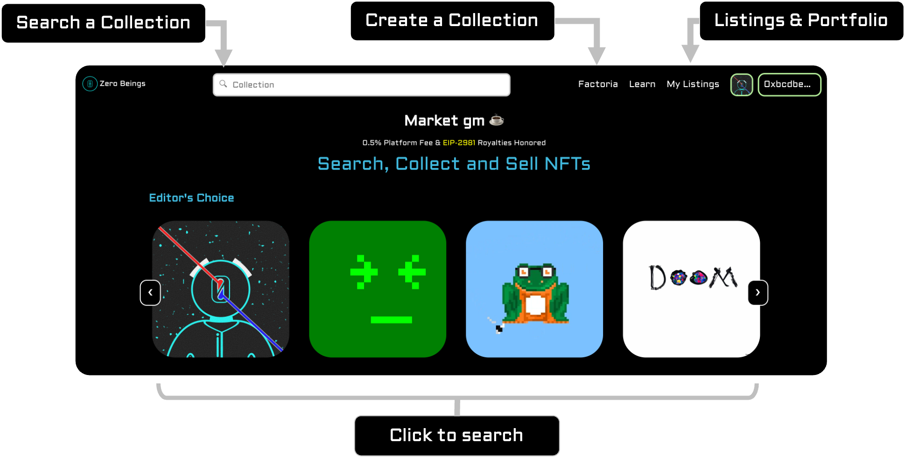
</p>

Continue to scroll down the page and three panels will render: the collection info, any available listings for that specific collection, and the NFTs minted for the searched collection.

<p align="center" width="100%">
    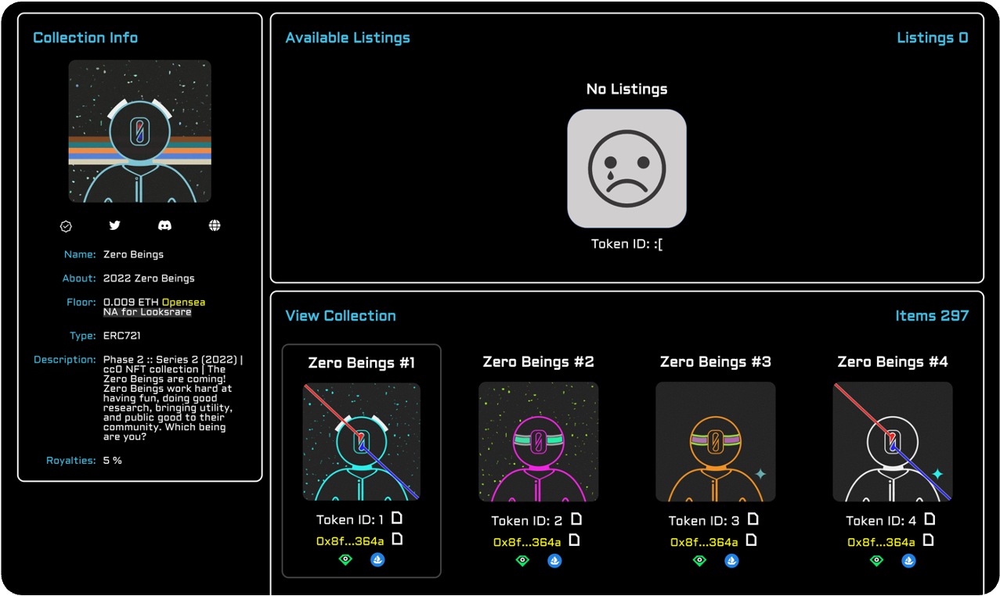
</p>

### Collection Info

The Collection Info panel contains a combination of imformation rendered from the NFT collection metadata, the collections opensea profile, and both opensea & looksrare floor prices if applicable. The roaltiy information is fetched from the smart contract with the rarible api.

<p align="center" width="100%">
    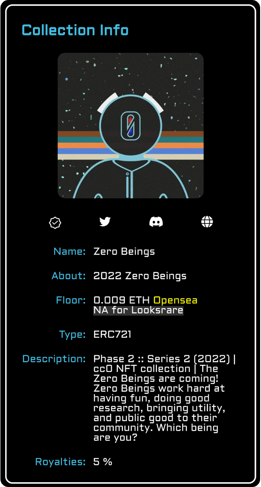
</p>

### Available Listings

The Available Listings displays all direct and auction listings for the collection being viewed. The number of total listings is labeled on the right hand side of the panel.

If there are no listings the view will look like this:

<p align="center" width="100%">
    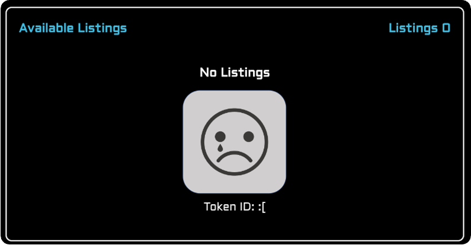
</p>

If there are listings available the view will look like this:

<p align="center" width="100%">
    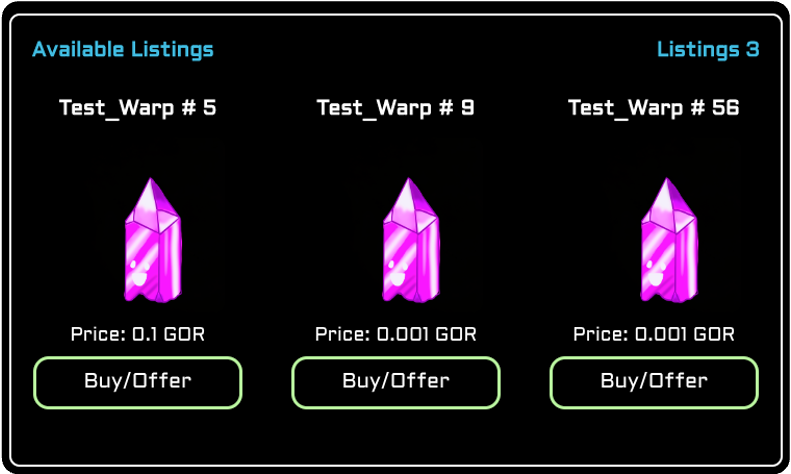
</p>

If the NFT or the Buy/Offer button is clicked, a detailed view of the listing of interest will be displayed.

#### Market Listing Detail View

If the wallet connected holds the NFT listed, a list of the offers will be displayed. If the wallet is the owner of the NFT, the title of the section heading above the offers is "Offers".

<p align="center" width="100%">
    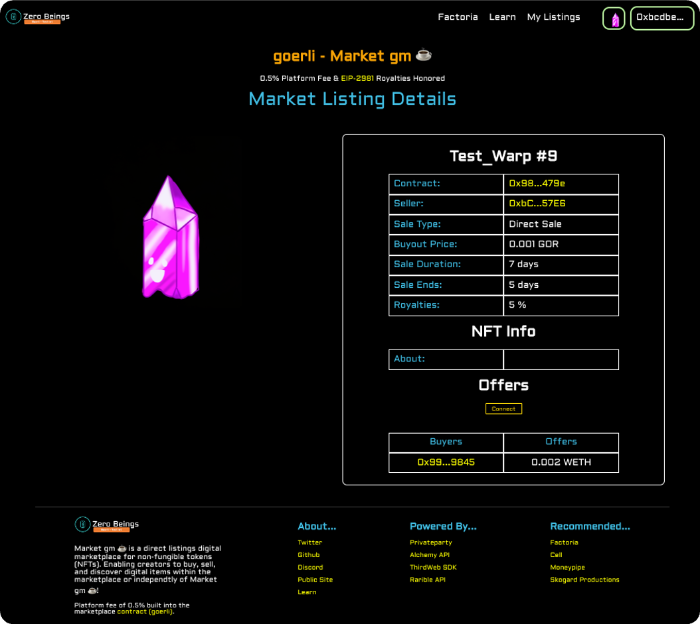
</p>

If the wallet connected is not the owner, the title will be rendered as "i want that!" above the list of competing offers.

<p align="center" width="100%">
    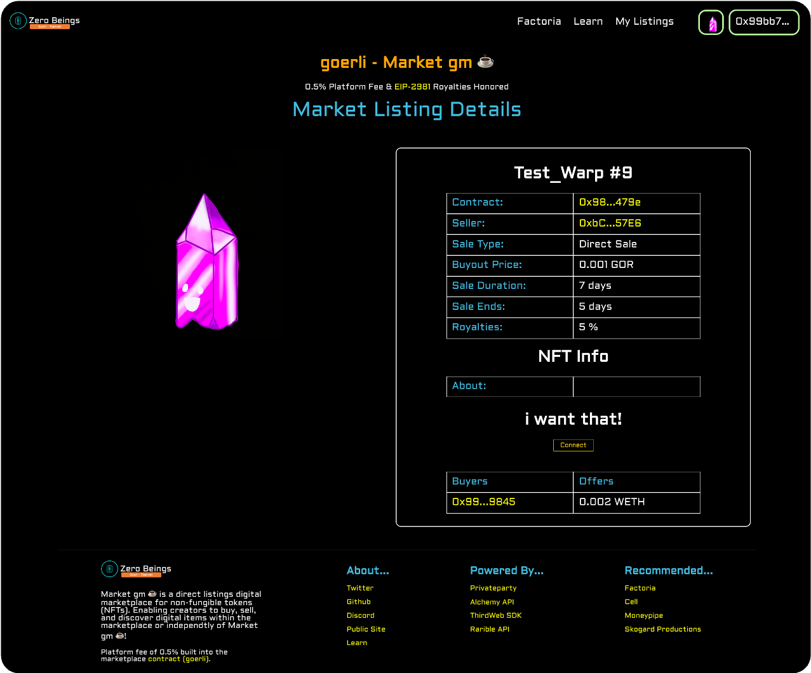
</p>


### Collection View
When the cursor hovers over an NFT in the collection a grey box will outline the NFT of interest. Each individual NFT will display the following information: The name, token ID, collection address (link to etherscan), a link to the NFT on looksrare and opensea.

<p align="center" width="100%">
    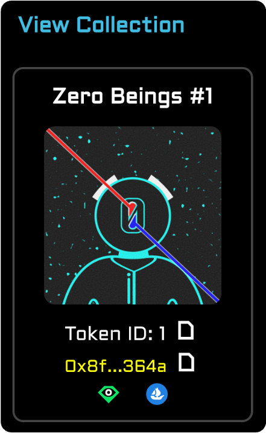
</p>

#### Detailed NFT View
If the the NFT is clicked, a detailed view will be displayed for the NFT of interest. The detailed view contains the following information: name, image/file, and NFT attributes.

<p align="center" width="100%">
    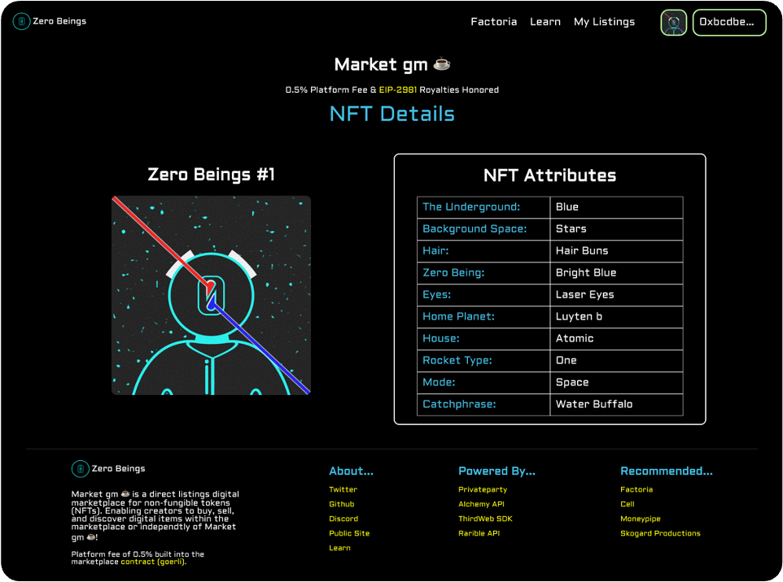
</p>

## My Listings

The My Listings page displays the following three panels: create listings, your listings, and your portfolio.

<p align="center" width="100%">
    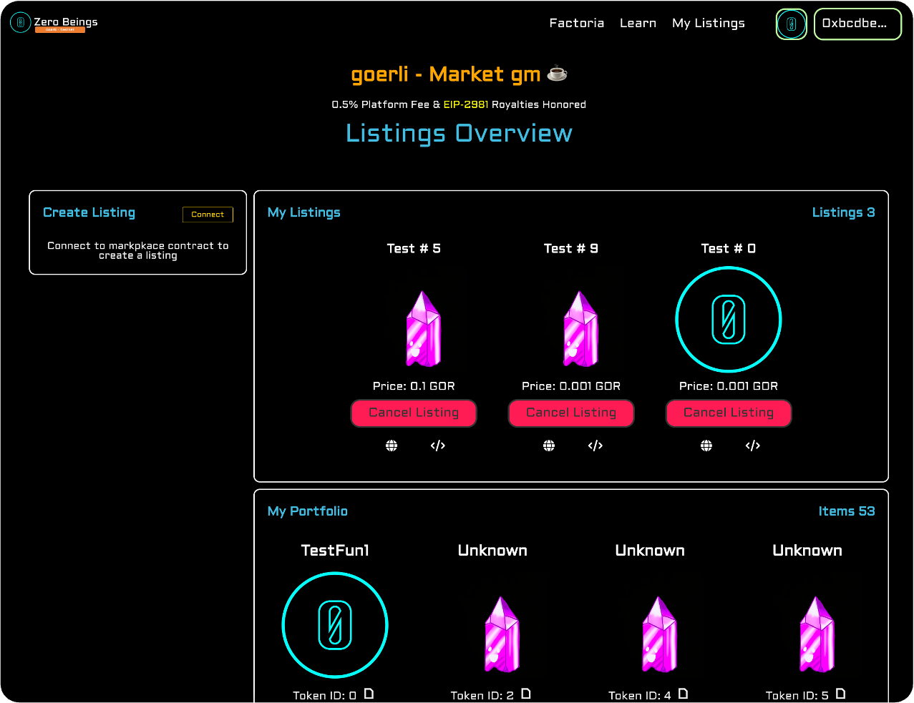
</p>

### Create Listing Panel

By clicking connect the wallet of choice will connect to the marketplace and will be ready to interact with the marketplace smart contract. The Create Listing will display two options: direct or auction.

<p align="center" width="100%">
    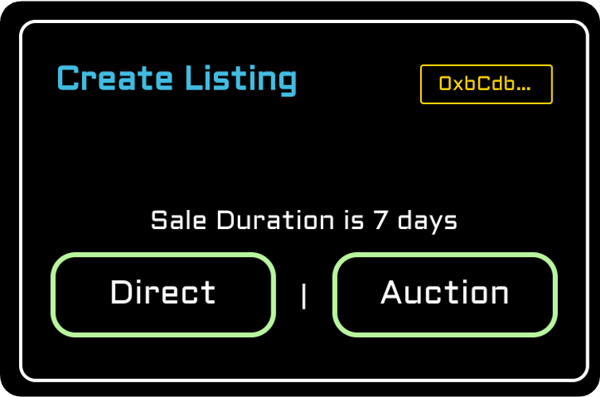
</p>

After selecting which listing option is preferred. The respective listing form will be displayed.

#### Create Direct Listing Form

<p align="center" width="100%">
    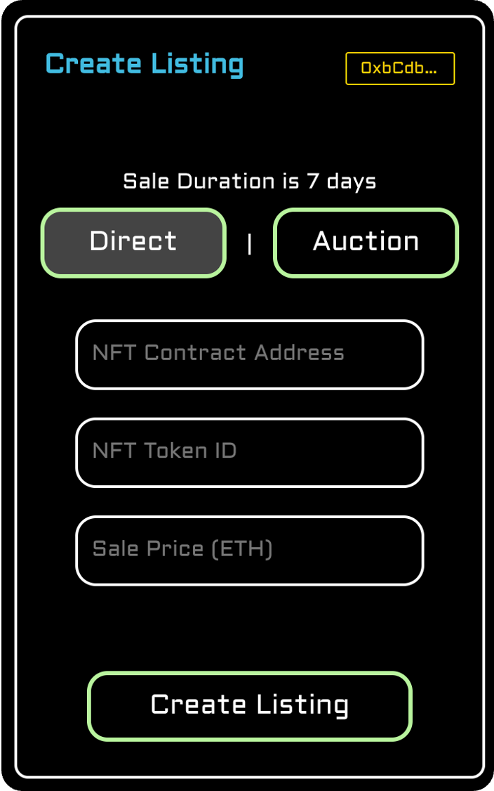
</p>

#### Create Auction Listing Form

<p align="center" width="100%">
    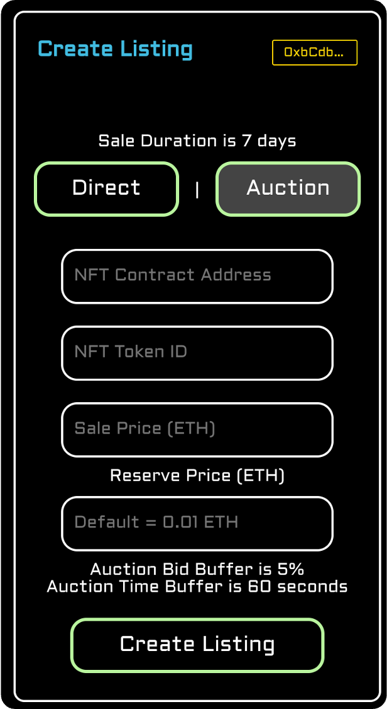
</p>

### My Listings Panel

The my listings panel contains a view of all the NFTs listed by the connected wallet.

<p align="center" width="100%">
    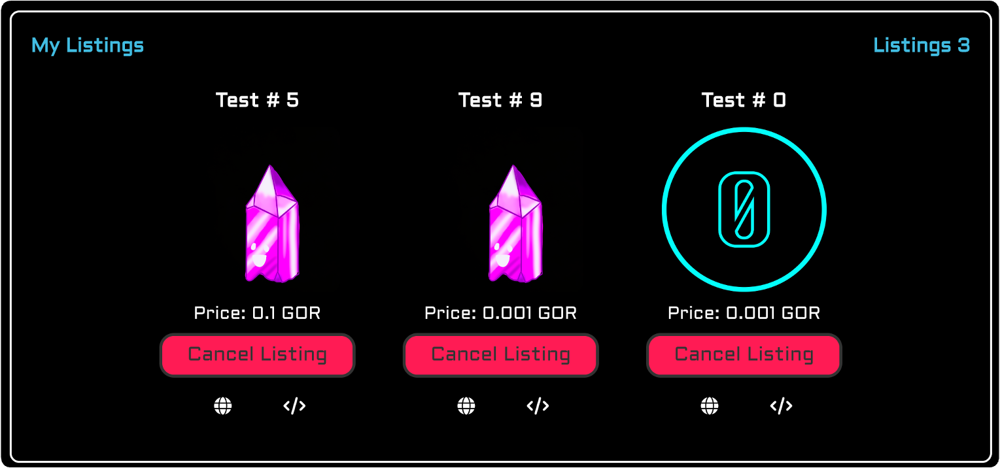
</p>

#### Individual Listings

Each individual listing displays the following: name, price & currency, a cancel listing button, a link to an auto-generated IPFS website, and the iframe embed code.

<p align="center" width="100%">
    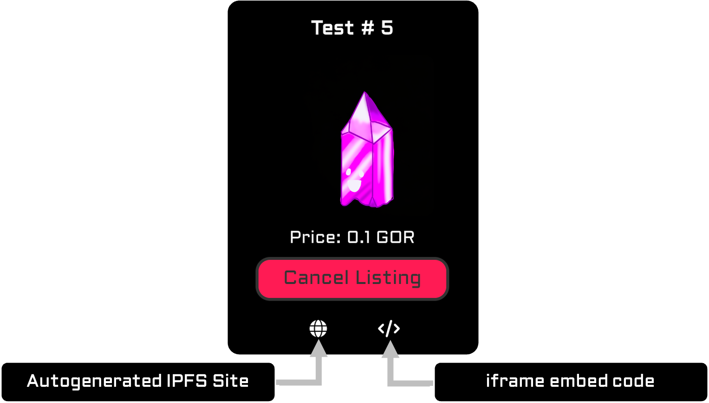
</p>

> The auto-generated IPFS website is a feature of the [thirdweb](https://thirdweb.com/?utm_source=embed) marketplace prebuilt smart contract.

If the globe is clicked, the user will be lead to the respective NFT listing website.

<p align="center" width="100%">
    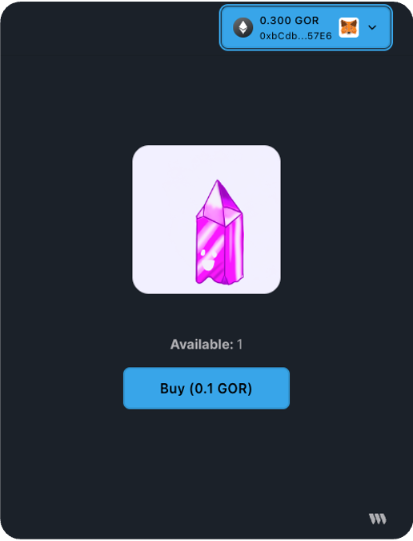
</p>

If the embed icon is clicked, the iframe embed code will be copied to the users clipboard. below is an example of what the code will look like:

```html
<iframe src="https://gateway.ipfscdn.io/ipfs/Qmcine1gpZUbQ73nk7ZGCcjKBVFYXrEtqrhujXk3HDQ6Nn/marketplace.html?contract=<marketplacecontract>&amp;chainId=5&amp;listingId=21&amp;theme=dark&amp;primaryColor=blue&amp;secondaryColor=red" width="600px" height="600px" style="max-width:100%;" frameborder="0"></iframe>
```


