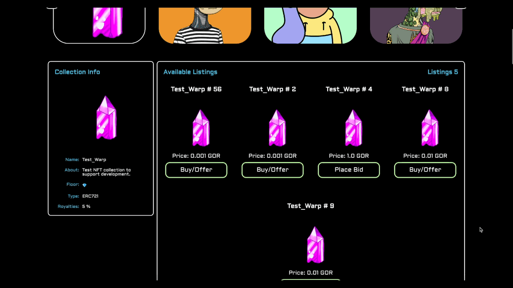
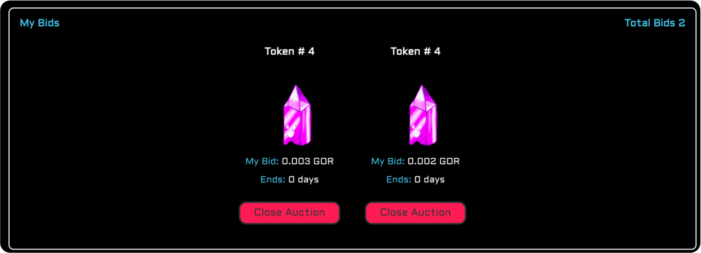
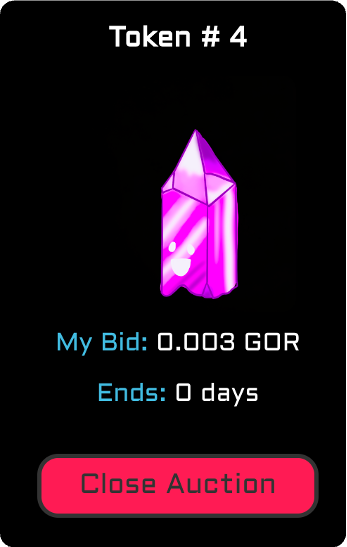

<p align="center" width="100%">
    
</p>

🚧 Under construction 🚧
## Market gm ☕️ - An NFT marketplace 

> 0.5% platform fee & [EIP-2981](https://eips.ethereum.org/EIPS/eip-2981) royalties honored, filetype flexibility, auto-generated IPFS site, and fully customizable.


1. **Overview:** A tour of the marketplace.
2. **Mobile Devices:** How to use Market gm as a progressive web application.
3. **Guide:** How to create & cancel listings, create & close auctions, create an offer and Buy.
4. **Metadata Structure:** Additional meta data feature for rendering non-image filetypes.
5. **goerli-market**: Overview of the goerli-market.
6. **Maretplace Repo:** Overview of the marketplace source code.
7. **More Info:** FAQs and source documentation.


# Overview

>   
> "Speak fren and enter." - Gandalf 🧙🏼‍♂️
>   
> Mint a Zero Being here [mint.zerobeings.xyz](https://mint.zerobeings.xyz)
>   

Market gm is an NFT gated marketplace. The connecting wallet must have a balance of at least one Zero Being NFT.
Wallet authorization is accomplished with [PrivateParty](https://privateparty.dev).

> Private Party is a dead simple blockchain auth framework created by [skogard](https://twitter.com/skogard)

<p align="center" width="100%">
    
</p>

To access Market gm ☕️ head over to [gm.zerobeings.xyz](https://gm.zerobeings.xyz) and login with your preferred wallet.

<p align="center" width="100%">
    
</p>

After logging into Zerb gm ☕️, open the menu on the left.

<p align="center" width="100%">
    
</p>

Click on goerli-market or Market gm ☕️.

<p align="center" width="100%">
    
</p>

goerli-market will load the goerli marketplace for testing collection launches and rendering various filetypes.

> Filetypes currently supported are as follows: .png, .svg, .jpg, .jpeg, .gif, .wav, .mp3, .ogg, .mp4, .webm, .doc, .docx, .pdf, and .txt.

After clicking on the preferred market (goerli or mainnet) the market view will display the following. The market is automatically rendered with the Zero Beings NFT collection.

> [factoria](https://docs.factoria.app/#/),  created by [skogard](https://twitter.com/skogard), is a simple cost effective tool to launch your NFT collection.

## Market gm view - mainnet

<p align="center" width="100%">
    
</p>

Continue to scroll down the page and three panels will render: the collection info, any available listings for that specific collection, and the NFTs minted for the searched collection.

<p align="center" width="100%">
    
</p>

### Collection Info

The Collection Info panel contains a combination of imformation rendered from the NFT collection metadata, the collections opensea profile, and both opensea & looksrare floor prices if applicable. The roaltiy information is fetched from the smart contract with the rarible api.

<p align="center" width="100%">
    
</p>

### Available Listings

The Available Listings displays all direct and auction listings for the collection being viewed. The number of total listings is labeled on the right hand side of the panel.

If there are no listings the view will look like this:

<p align="center" width="100%">
    
</p>

If there are listings available the view will look like this:

<p align="center" width="100%">
    
</p>

If the NFT or the Buy/Offer button is clicked, a detailed view of the listing of interest will be displayed.

#### Market Listing Detail View

If the wallet connected holds the NFT listed, a list of the offers will be displayed. If the wallet is the owner of the NFT, the title of the section heading above the offers is "Offers".

<p align="center" width="100%">
    
</p>

If the wallet connected is not the owner, the title will be rendered as "i want that!" above the list of competing offers.

<p align="center" width="100%">
    
</p>


### Collection View
When the cursor hovers over an NFT in the collection a grey box will outline the NFT of interest. Each individual NFT will display the following information: The name, token ID, collection address (link to etherscan), a link to the NFT on looksrare and opensea.

<p align="center" width="100%">
    
</p>

#### Detailed NFT View
If the the NFT is clicked, a detailed view will be displayed for the NFT of interest. The detailed view contains the following information: name, image/file, and NFT attributes.

<p align="center" width="100%">
    
</p>

## My Listings

The My Listings page displays the following three panels: create listings, your listings, and your portfolio.

<p align="center" width="100%">
    
</p>

### Create Listing Panel

By clicking connect the wallet of choice will connect to the marketplace and will be ready to interact with the marketplace smart contract. The Create Listing will display two options: direct or auction.

<p align="center" width="100%">
    
</p>

After selecting which listing option is preferred. The respective listing form will be displayed.

#### Create Direct Listing Form

<p align="center" width="100%">
    
</p>

#### Create Auction Listing Form

<p align="center" width="100%">
    
</p>

### My Listings Panel

The my listings panel contains a view of all the NFTs listed by the connected wallet.

<p align="center" width="100%">
    
</p>

#### Individual Listings

Each individual listing displays the following: name, price & currency, a cancel listing button, a link to an auto-generated IPFS website, and the iframe embed code.

<p align="center" width="100%">
    
</p>

>   
> The auto-generated IPFS website is a feature of the [thirdweb](https://thirdweb.com/?utm_source=embed) prebuilt marketplace smart contract.
>   


If the globe is clicked, the user will be lead to the respective NFT listing website.

<p align="center" width="100%">
    
</p>

If the embed icon is clicked, the iframe embed code will be copied to the users clipboard. below is an example of what the code will look like:

```html
<iframe src="https://gateway.ipfscdn.io/ipfs/Qmcine1gpZUbQ73nk7ZGCcjKBVFYXrEtqrhujXk3HDQ6Nn/marketplace.html?contract=<marketplacecontract>&amp;chainId=5&amp;listingId=21&amp;theme=dark&amp;primaryColor=blue&amp;secondaryColor=red" width="600px" height="600px" style="max-width:100%;" frameborder="0"></iframe>
```
### My Portfolio Panel

The my portfolio panel displays all the NFTs owned by the connected wallet. Each NFT will display the following information: name, image, token ID, collection address, link to looksrare & opensea, and list button.

<p align="center" width="100%">
    
</p>

If the NFT is clicked on a detailed view of the NFT will be displayed, similar to the detailed view from the Detailed NFT View.

# Mobile Devices

> Zerb gm ☕️ is set up to function as a progressive web application (A2HS). Zerb gm ☕️ is the gateway to Market gm ☕️. 

The manifest.webmanifest is deployed as shown below. Adjust these parameters when customizing the marketplace with your NFT collection branding and colorsheme. This configuration will allow the webapp to be full screen when launched from the phone icon link giving the user a phone app like experience.

```html
{
    "background_color": "black",
    "description": "Zerb gm ☕️",
    "display": "fullscreen",
    "icons": [
      {
        "src": "icon/zero-icon.png",
        "sizes": "192x192",
        "type": "image/png"
      }
    ],
    "name": "Zerb gm ☕️",
    "short_name": "Zerb gm ☕️",
    "start_url": "/login"
  }
```
## A2HS
To create the webapp link on phone's home screen go to [gm.zerobeings.xyz](https://gm.zerobeings.xyz) or your custom domain using the phone's native browser application.

<p align="center" width="100%">
    
</p>

## User Experience
Now the webapp will have a link from the phone home screen. This gives a similar experience to a native application. Users can log in with there preferred mobile wallet.

<p align="center" width="100%">
    
</p>

# Guide
The guide will demonstrate all the functions utilized through the Market gm ☕️ user interface. There are additional functions that can be explored by reviewing the smart contract [0xe6342bf304bac1064b96e71e5343a90fef332dd0](https://goerli.etherscan.io/address/0xe6342bf304bac1064b96e71e5343a90fef332dd0#code). In the case of creating a listing and submitting an offer multiple smart contract interactions will occur. These two scenarios require two transactions to complete the function. The details are outlined in their respective sections.

## Create Direct Listing
> Description from the [thirdWeb portal](https://portal.thirdweb.com/pre-built-contracts/marketplace)
>
>Direct listings are low commitment, high-frequency listings; people constantly list and de-list their NFTs based on market trends. So, the listed NFTs and offer amounts are not escrowed in the Marketplace to keep the seller's NFTs and the buyer's currency liquid.
>
>This allows users to list NFTs for sale just by signing an approval; giving them the freedom to list the same NFT in multiple marketplaces, e.g. this Marketplace contract, OpenSea, etc. at the same time.
>
>Key elements of a direct listing:
>
> * Sellers list their NFT for direct sale with the price users can buy it for.
> * The NFT remains in your wallet, but you provide permission for the marketplace contract to move the NFT.
> * If a user pays the asking price, the NFT will be transferred to them, and the seller will receive the funds.
> * Users can make offers below the asking price, and the listing can have multiple offers. The seller can choose to accept an offer at any time.

To create a listing two transactions must occur. The first transaction gives permission to the marketplace contract to transfer your NFT upon sale. The first transaction is an approval function on the collection smart contract. The second transaction approves creation of the listing on the marketplace contract at the listing price specified in the listing form. All direct listings are for a duration of 7 days.

Connect, select "Direct", approve access to and transfer of your NFT to be listed, and approve listing of the NFT.

<p align="center" width="100%">
    
</p>

## Seller

### Accept a Direct Listing Offer
If you would like to accept an offer for a directlistings. Navigate to the My Listings page and then to the My Listings Panel. Select the NFT you would like to accept an offer on. Connect your wallet and an "accept" button will appear. Click "accept" to accept the offer from the offering wallet address.

<p align="center" width="100%">
    
</p>

### Cancel Direct Listing
To cancel a direct listing first a wallet must be connect and secondly a cancel transaction must be approved. Only listings created by the wallet address that owns the NFT will be displayed.

> Click "cancel" on the NFT listing you would like to cancel. Connect wallet & approve cancel transaction.

<p align="center" width="100%">
    
</p>

## Buyer
### Submit an Offer on Direct Listing 

> ⚠️ Once an offer is made it can not be cancelled.

If you would like to offer a price lower than the listed price, input the desired offer amount and click "Make Offer". You will need to approve two transactions. The frist transaction will be to approve the WETH spending limit. This limit matches the amount of the proposed offer. Once the spend limit is approved, the offer transaction must be approved to complete the offer. All offers will be be populated in the "Offers"/"i want that" section of the NFT details panel.

<p align="center" width="100%">
    
</p>

### Buy at Listed Price
If you would like to purchase the NFT at the listed price, click the "Buy" button and approve the buy transaction.

<p align="center" width="100%">
    
</p>

## Create Auction
> Description from the [thirdWeb portal](https://portal.thirdweb.com/pre-built-contracts/marketplace)
>
>Auction listings are high commitment, low-frequency listings. The seller and bidders respect the auction window, and recognize that their NFTs / bid amounts will be illiquid for the auction duration, and expect a guaranteed payout at auction closing — the auctioned items for the bidder, and the winning bid amount for the seller.
>
>Both the NFTs that are listed for sale in an auction and the highest bid at any given moment are escrowed in the market.
>
>Key elements of an auction listing:
>
>* Sellers list their NFT for auction with a minimum asking price.
>* The NFT is transferred to escrow in the marketplace contract until the auction is canceled or finished.
>* Other users can place bids until the auction is closed.
>* Users can only make a bid if it is higher than the current highest bid (or asking price if there are no bids). Once made, bids cannot be withdrawn, and the auction contract holds the funds in escrow.
>* At the end of the auction, no more bids can be placed.
>* At the end of the auction, the ```closeAuction``` function needs to be called twice; once for the buyer and once for the seller.

⚠️ Take caution when creating an auction as the buyer and seller must close the auction. As a seller, it would be prudent to save the address of the winning bid to attempt reaching out to wallet owner.

To initiate an auction two transactions must occur. The first transaction transfers the NFT being put for auction to escrow in the marketplace contract. The second transaction passes the NFT to be auctioned and the auction parameters. The auction form requires the NFT collection address, NFT token ID, the Sale Price in ETH (buyout price), and the reserve price (minimum initial bid).

<p align="center" width="100%">
    
</p>

After bids are received for an auction the listing details page will display the bids received.

<p align="center" width="100%">
    
</p>

## Bid on Auctioned NFT
> Winning bid can be placed within 60 seconds of the auction closing.

To bid on an auction NFT click on the NFT beings auctioned from the Available Listings panel on the Market gm ☕️ home page. You will be directed to a detail view of the listing page. Review the listing details. Near the bottom of the listing detail panel there is a section titled "i want that". Click the connect button to connect to the marketplace contract and reveal two purchasing options. The first option is to buyout the NFT. The buyout price is in the listing destils. The second option is to place a bid on the NFT. If you are the first person to bid, your bid price must meet the reserve price (minimum bid amount). If there are other bids, they will be listed under the "i want that" title and your bid must be 5% higher than the highest bid. The bid duration is equal to the time left until auction has ended.

> Reminder, if you are the winning bid you must close the auction at the end of the sale duration to complete the transaction and transfer of the NFT into you wallet.

<p align="center" width="100%">
    
</p>

After you have placed a bid on an NFT a My Bids panel will be generated on the My Listings page. If you place multiple bids on a single NFT, all bids will be displayed.

<p align="center" width="100%">
    
</p>

## Close Auction
When an auction is created the default auction duration is 7 days. Any bid submitted will expire at the end of the auction.

> At the end of the auction, the ```closeAuction``` function needs to be called twice; once for the buyer and once for the seller. [thirdWeb portal](https://portal.thirdweb.com/pre-built-contracts/marketplace)

### Seller
When the seller is ready to close the auction, the seller wallet address must navigate to the My Listings page. Navigate to NFT being auctioned under the My Listings panel and click "Close Auction" located under the NFT being auctioned. In this example, test #4 is the NFT with the "Close Auction" option.

<p align="center" width="100%">
    
</p>

> ⚠️ It is recomended to take record of the highest bidders address prior to closing the auction.

Once the close auction function is initiated. You will be asked to connect your wallet and then submit the transaction to close the auction. After the auction is closed the NFT will no longer be available on your listings panel. 

### Buyer
At the close of the auction a Close Auction button will appear below you bids. If you held the winning bid, you click the Close Auction button under the winning bid in the My Bids Panel. All bids will be displayed in the My Bids panel. If you are in a bidding war for an NFT, all bids placed for that NFT will be listed here.

<p align="center" width="100%">
    
</p>

In this example, you will click on the Close Auction button below the bid for 0.003 GOR.

<p align="center" width="100%">
    
</p>

## Buyout auction
If you would prefer to buyout the auction, you can do so by clicking the "Buyout" button. First search the NFT collection of interest, locate the NFT that is available for auction. Click on the "Place Bid" button. You will be navigated to the listings detail page. Review the details of the NFT and the buyout price displayed in the detail view. Navigate to the "i want that" section, then connect your wallet. Click "Buyout" to initiate the buy fuction to buyout the auction.

<p align="center" width="100%">
    
</p>

# Metadata Structure
It is recommended to follow the metadata structure standard developed by [opensea](https://docs.opensea.io/docs/metadata-standards) with two additional items: file and filetype. This will simplify the marketplace sort function when listing non-image based NFTs. It enables to the ability for future file type rendering as well.

```json
{
    "id": "1",
    "name": "Example NFT #1",
    "description": "2023 Test NFT",
    "image": "ipfs://qwe.../00001.png",
    "external_url": "https://yourdomain.com/1",
    "file": "ipfs://qwe.../00001.png",
    "filetype": "png",
    "attributes": [
        {
            "trait_type": "T-Shirt",
            "value": "Blue"
        },
        {
            "trait_type": "Background",
            "value": "Stars"
        }
    ]
}
```
# goerli-market
The goerli-market aspect of the website has some limitations as compared to the mainnet pages.
The limitations are commented in server.js and are as follows:

* Alchemy API does not currently support `summarizeNFTAttributes` on the goerli testnet api.
* Alchemy API does not currently support `getFloorPrice` on the goerli testnet api.
* Alchemy API does not currently support `reingestContract` on the goerli testnet api.

These limitations also prevent a total supply for a collection from beings retrived. If the collection exceeds 100, the collection items will be displayed as `+100` in the "Collection View" panel on the home page and enough pages will be calculated for a collectin of 10,000 NFTs.

# Marketplace Repo
This marketplace repository can be found at the Zero Beings github page. 

## Repo Quickstart
Follow the guide below to get started on your own NFT marketplace today!

### Prerequisites
* [NodeJs](https://nodejs.org/en/download/)

### Installation
> 🚨 [Wallet Connect](https://github.com/WalletConnect/web3modal-vanilla-js-example) recommends only running the modal on https. HTTPS setup instructions can be found on the Wallet Connect github repo.

> 🚨 Wallet Connect recently depreciated v1.0. Next step is to upgrade the connect functionality for Market gm .

1. Fork the project.
2. Clone the project.
3. Navigate to the project directory `cd zerb-nft-marketplace`.
4. Install dependencies with `npm install`.
5. Run `node server` (🚨 not recommended by Wallet Connect).

### Making it your Own
1. Change the NFT gating contract and user name.
2. Deploy your own thirdweb goerli marketplace [contract](https://thirdweb.com/dashboard/contracts). 
3. Deploy your own thirdweb mainnet marketplace [contract](https://thirdweb.com/dashboard/contracts).
4. Update the marketplace contract address.

#### Change the NFT Gate

> A complete guide can be found at Skograd's [PrivateParty](https://privateparty.dev)

You will first need to update the private party authorization. Below is the current server authorization with a user `'zerb'`, contract name `zerb`, a contract address `'0x8FbA3ebe77D3371406a77EEaf40c89C1Ed55364a'`, and a balance call function

```javascript
let balance = await contracts.zerb.methods.balanceOf(account).call()`
```

```javascript
party.add('zerb', {
  contracts: {
    zerb: {
      address: '0x8FbA3ebe77D3371406a77EEaf40c89C1Ed55364a', //for zero beings 
      rpc: process.env.RPC,
      abi: party.abi.erc721,
    },
  },
  authorize: async (req, account, contracts) => {
    let balance = await contracts.zerb.methods.balanceOf(account).call();
    if (balance > 0) return { balance: balance };
    else
      throw new Error(
        "You must own at least one 'Zero Being' mint at https://mint.zerobeings.xyz"
      );
  },
});
```

For example, let say you would like to change the user and the NFT gate, the changes would look something like this:

```javascript
party.add('user', {
  contracts: {
    mycontract: {
      address: '0x0........', //your collection address
      rpc: process.env.RPC,
      abi: party.abi.erc721,
    },
  },
  authorize: async (req, account, contracts) => {
    let balance = await contracts.mycontract.methods.balanceOf(account).call();
    if (balance > 0) return { balance: balance };
    else
      throw new Error(
        "You must own at least one 'Your NFT' mint at https://yourdomain.com"
      );
  },
});
```

#### Using Your Own Marketplace Contracts
There are total seven locations in which the goerli & mainnet contracts are explicitly used.

1. server.js
2. mbox.json
3. gbox.json
4. listingsCard.ejs (IPFS Link)
5. mybids.ejs (IPFS Link)
6. goerli-listingsCard.ejs (IPFS Link)
7. goerli-mybids.ejs (IPFS Link)

# More Info
If you would like to take a deep dive into the tools used to build this marketplace, review the reference documents. The additional resources section is a list of tools to help you launch and manage your NFT collections. Enjoy!

## FAQs
* Can any collection be listed on the marketplace?
    Yes, the marketplace contract is setup to allow sale of any NFT collection.

* Can any wallet address list an NFT on the marketplace?
    Yes, any wallet can create a listing on the NFT marketplace

* What is the platform fee for a sale on the marketplace?
    We charge a platform fee of 0.5% for each sale.

## Reference Documents
* Skogard Productions [PrivateParty](https://privateparty.dev)
* Skogard Productions [factoria](https://docs.factoria.app/#/)
* Alchemy NFT [API](https://docs.alchemy.com/reference/nft-api-quickstart) 
* Thirdweb marketplace contract technical [documents](https://portal.thirdweb.com/contracts/design/Marketplace#currency-transfers)
* Thirdweb typescript documentation [typescript](https://portal.thirdweb.com/typescript/sdk.marketplace)
* Rarible [API](https://multichain-api.rarible.org/v0.1/tag/item-controller#operation/getItemRoyaltiesById)

## Additional Resources
* Skogard Productions [Cell](https://cell.computer/#/?id=introduction)
* Skogard Productions [Moneypipe](https://moneypipe.xyz/)