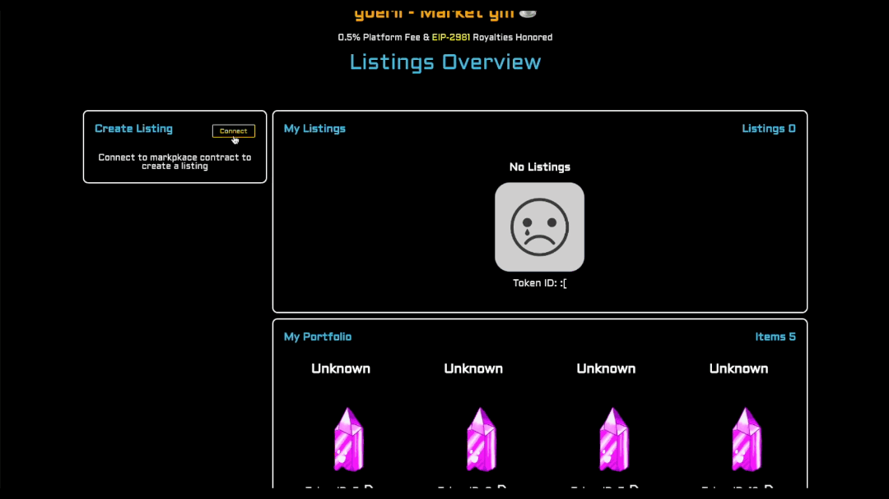

<p align="center" width="100%">
    
</p>

# Powered By

<p align="center" width="100%">
  
</p>

# Market gm ☕️ - An NFT marketplace

## Introduction

Market gm ☕️ is a new NFT marketplace that allows you to buy, directly sell, and auction NFTs inside and outside the marketplace. This flexibility is achieved through the thirdWeb marketplace contract ([contract audit report](https://gateway.ipfscdn.io/ipfs/QmNgNaLwzgMxcx9r6qDvJmTFam6xxUxX7Vp8E99oRt7i74/)). 

> 0.5% platform fee & [EIP-2981](https://eips.ethereum.org/EIPS/eip-2981) royalties honored, filetype flexibility, auto-generated IPFS site, and fully customizable.

1. **[Overview](#overview):** A tour of the marketplace.
2. **[Mobile Devices](#mobile-devices):** How to use Market gm as a progressive web application.
3. **[Guide](#guide):** How to create & cancel listings, create & close auctions, create an offer and Buy.
4. **[Metadata Structure](#metadata-structure):** Additional meta data feature for rendering non-image filetypes.
5. **[goerli-market](#goerli-market)**: Overview of the goerli-market.
6. **[Marketplace Repo](#marketplace-repo):** Overview of the marketplace source code.
7. **[More Info](#more-info):** FAQs and source documentation.

## News & Community

>
> * Twitter: [https://twitter.com/Zero_beings](https://twitter.com/Zero_beings)
> * Discord: [https://discord.gg/rZMzVCx96W](https://discord.gg/rZMzVCx96W)
> * Medium: [https://zerobeings.medium.com/](https://zerobeings.medium.com/)
>

# Overview

>   
> "Speak fren and enter." - Gandalf 🧙🏼‍♂️
>   
> Mint a Zero Being here [mint.zerobeings.xyz](https://mint.zerobeings.xyz)
>   

Market gm is an NFT gated marketplace. The connecting wallet must have a balance of at least one Zero Being NFT.
Wallet authorization is accomplished with [PrivateParty](https://privateparty.dev).

> Private Party is a dead simple blockchain auth framework created by [skogard](https://twitter.com/skogard)

<p align="center" width="100%">
    
</p>

To access Market gm ☕️ head over to [gm.zerobeings.xyz](https://gm.zerobeings.xyz) and login with your preferred wallet.

<p align="center" width="100%">
    
</p>

After logging into Zerb gm ☕️, open the menu on the left.

<p align="center" width="100%">
    
</p>

Click on goerli-market or Market gm ☕️.

<p align="center" width="100%">
    
</p>

goerli-market will load the goerli marketplace for testing collection launches and rendering various filetypes.

> Filetypes currently supported are as follows: .png, .svg, .jpg, .jpeg, .gif, .wav, .mp3, .ogg, .mp4, .webm, .doc, .docx, .pdf, and .txt.

After clicking on the preferred market (goerli or mainnet) the market view will display the following. The market is automatically rendered with the Zero Beings NFT collection.

> [factoria](https://docs.factoria.app/#/),  created by [skogard](https://twitter.com/skogard), is a simple cost effective tool to launch your NFT collection.

## Market gm view - mainnet

<p align="center" width="100%">
    
</p>

Continue to scroll down the page and three panels will render: the collection info, any available listings for that specific collection, and the NFTs minted for the searched collection.

<p align="center" width="100%">
    
</p>

### Collection Info

The Collection Info panel contains a combination of information rendered from the NFT collection metadata, the collections opensea profile, and both opensea & looksrare floor prices if applicable. The royalty information is fetched from the smart contract with the rarible api.

<p align="center" width="100%">
    
</p>

### Available Listings

The Available Listings displays all direct and auction listings for the collection being viewed. The number of total listings is labeled on the right-hand side of the panel.

If there are no listings, then the view will look like this:

<p align="center" width="100%">
    
</p>

If there are listings available, then the view will look like this:

<p align="center" width="100%">
    
</p>

If the NFT or the Buy/Offer button is clicked, a detailed view of the listing of interest will be displayed.

#### Market Listing Detail View

If the wallet connected holds the NFT listed, a list of the offers will be displayed. If the wallet is the owner of the NFT, the title of the section heading above the offers is "Offers".

<p align="center" width="100%">
    
</p>

If the wallet connected is not the owner, the title will be rendered as "i want that!" above the list of competing offers.

<p align="center" width="100%">
    
</p>


### Collection View
When the cursor hovers over an NFT in the collection a grey box will outline the NFT of interest. Each individual NFT will display the following information: The name, token ID, collection address (link to etherscan), a link to the NFT on looksrare and opensea.

<p align="center" width="100%">
    
</p>

#### Detailed NFT View
If the NFT is clicked, a detailed view will be displayed for the NFT of interest. The detailed view contains the following information: name, image/file, and NFT attributes.

<p align="center" width="100%">
    
</p>

## My Listings

The My Listings page displays the following three panels: create listings, your listings, and your portfolio.

<p align="center" width="100%">
    
</p>

### Create Listing Panel

By clicking connect the wallet of choice will connect to the marketplace and will be ready to interact with the marketplace smart contract. The Create Listing will display two options: direct or auction.

<p align="center" width="100%">
    
</p>

After selecting which listing option is preferred. The respective listing form will be displayed.

#### Create Direct Listing Form

<p align="center" width="100%">
    
</p>

#### Create Auction Listing Form

<p align="center" width="100%">
    
</p>

### My Listings Panel

The My Listings panel contains a view of all the NFTs listed by the connected wallet.

<p align="center" width="100%">
    
</p>

#### Individual Listings

Each individual listing displays the following: name, price & currency, a cancel listing button, a link to an auto-generated IPFS website, and the iframe embed code.

<p align="center" width="100%">
    
</p>

>   
> The auto-generated IPFS website is a feature of the [thirdweb](https://thirdweb.com/?utm_source=embed) prebuilt marketplace smart contract.
>   


If the globe is clicked, the user will be lead to the respective NFT listing website. This allows sales outside of Market gm. Meaning, wallets do not require access to Market gm purchase the NFT.

<p align="center" width="100%">
    
</p>

If the embed icon is clicked, the iframe embed code will be copied to the users clipboard. below is an example of what the code will look like:

```html
<iframe src="https://gateway.ipfscdn.io/ipfs/Qmcine1gpZUbQ73nk7ZGCcjKBVFYXrEtqrhujXk3HDQ6Nn/marketplace.html?contract=<marketplacecontract>&amp;chainId=5&amp;listingId=21&amp;theme=dark&amp;primaryColor=blue&amp;secondaryColor=red" width="600px" height="600px" style="max-width:100%;" frameborder="0"></iframe>
```
### My Portfolio Panel

The My Portfolio panel displays all the NFTs owned by the connected wallet. Each NFT will display the following information: name, image, token ID, collection address, link to looksrare & opensea, and list button.

<p align="center" width="100%">
    
</p>

If the NFT is clicked on a detailed view of the NFT will be displayed, similar to the detailed view from the Detailed NFT View.

# Mobile Devices

> Zerb gm ☕️ is set up to function as a progressive web application (A2HS). Zerb gm ☕️ is the gateway to Market gm ☕️. 

The manifest.webmanifest is deployed as shown below. Adjust these parameters when customizing the marketplace with your NFT collection branding and color scheme. This configuration will allow the webapp to be full screen when launched from the phone icon link giving the user a phone app like experience.

```html
{
    "background_color": "black",
    "description": "Zerb gm ☕️",
    "display": "fullscreen",
    "icons": [
      {
        "src": "icon/zero-icon.png",
        "sizes": "192x192",
        "type": "image/png"
      }
    ],
    "name": "Zerb gm ☕️",
    "short_name": "Zerb gm ☕️",
    "start_url": "/login"
  }
```
## A2HS
To create the webapp link on phone's home screen go to [gm.zerobeings.xyz](https://gm.zerobeings.xyz) or your custom domain using the phone's native browser application.

<p align="center" width="100%">
    
</p>

## User Experience
Now the webapp will have a link from the phone home screen. This gives a similar experience to a native application. Users can log in with their preferred mobile wallet. This is essentially a read-only experience. If you would like a mobile read and write experience, please use the web3 browser located in your preferred wallet application.

<p align="center" width="100%">
    
</p>

# Guide
The guide will demonstrate all the functions utilized through the Market gm ☕️ user interface. There are additional functions that can be explored by reviewing the testnet smart [contract](https://goerli.etherscan.io/address/0xC65CE759f006928451343874538A328dFcbAD325#code). The details are outlined in their respective sections.

## Create Direct Listing
> Description from the [thirdWeb portal](https://portal.thirdweb.com/pre-built-contracts/marketplace)
>
>Direct listings are low commitment, high-frequency listings; people constantly list and de-list their NFTs based on market trends. So, the listed NFTs and offer amounts are not escrowed in the Marketplace to keep the seller's NFTs and the buyer's currency liquid.
>
>This allows users to list NFTs for sale just by signing an approval; giving them the freedom to list the same NFT in multiple marketplaces, e.g. this Marketplace contract, OpenSea, etc. at the same time.
>
>Key elements of a direct listing:
>
> * Sellers list their NFT for direct sale with the price users can buy it for.
> * The NFT remains in your wallet, but you provide permission for the marketplace contract to move the NFT.
> * If a user pays the asking price, the NFT will be transferred to them, and the seller will receive the funds.
> * Users can make offers below the asking price, and the listing can have multiple offers. The seller can choose to accept an offer at any time.

### First Time Listing for Collection
To create a listing for a collection for the first time two transactions must occur. The first transaction gives permission to the marketplace contract to transfer your NFT upon sale. The second transaction approves creation of the listing on the marketplace contract at the listing price specified in the listing form. All direct listings are for a duration of 7 days.

Connect, select "Direct", approve access to your NFT to be listed, and approve listing of the NFT.

<p align="center" width="100%">
    
</p>

### Subsequent Listings for Collection
A check is performed to determine if permission to NFT collection has been given for your wallet address. If this check returns true, then only one transaction is required to create the listing. This transaction approves creation of the listing on the marketplace contract at the listing price specified in the listing form. All direct listings are for a duration of 7 days.

Connect, select "Direct", approve listing of the NFT.

<p align="center" width="100%">
    
</p>

## Seller

### Accept a Direct Listing Offer
If you would like to accept an offer for a direct listing. Navigate to the My Listings page and then to the My Listings Panel. Select the NFT you would like to accept an offer on. Connect your wallet and an "accept" button will appear. Click "accept" to accept the offer from the offering wallet address.

<p align="center" width="100%">
    
</p>

### Cancel Direct Listing
To cancel a direct listing: first a wallet must be connected and secondly a cancel transaction must be approved. Only listings created by the wallet address that owns the NFT will be displayed.

> Click "cancel" on the NFT listing you would like to cancel. Connect wallet & approve cancel transaction.

<p align="center" width="100%">
    
</p>

## Buyer
### Submit an Offer on Direct Listing 

> ⚠️ Once an offer is made it cannot be cancelled.
> All offers are for the entire sales period of the NFT. For example, if there are 6 days left on sale, then offer duration will be 6 days.

If you would like to offer a price lower than the listed price, input the desired offer amount and click "Make Offer". You will need to approve two transactions. The first transaction will approve the WETH spending limit. This limit matches the amount of the proposed offer. Once the spend limit is approved, the offer transaction must be approved to complete the offer. All offers will be be populated in the "Offers" or "i want that" section of the NFT details panel.

<p align="center" width="100%">
    
</p>

If you have previously approved a spend limit greater than or equal to the offer amount for the market gm contract, then only one transaction is required to make the offer.

<p align="center" width="100%">
    
</p>

### Buy at Listed Price
If you would like to purchase the NFT at the listed price, click the "Buy" button and approve the buy transaction.

<p align="center" width="100%">
    
</p>

## Create Auction
> Description from the [thirdWeb portal](https://portal.thirdweb.com/pre-built-contracts/marketplace)
>
>Auction listings are high commitment, low-frequency listings. The seller and bidders respect the auction window, and recognize that their NFTs / bid amounts will be illiquid for the auction duration, and expect a guaranteed payout at auction closing — the auctioned items for the bidder, and the winning bid amount for the seller.
>
>Both the NFTs that are listed for sale in an auction and the highest bid at any given moment are escrowed in the market.
>
>Key elements of an auction listing:
>
>* Sellers list their NFT for auction with a minimum asking price.
>* The NFT is transferred to escrow in the marketplace contract until the auction is canceled or finished.
>* Other users can place bids until the auction is closed.
>* Users can only make a bid if it is higher than the current highest bid (or asking price if there are no bids). Once made, bids cannot be withdrawn, and the auction contract holds the funds in escrow.
>* At the end of the auction, no more bids can be placed.
>* At the end of the auction, the ```closeAuction``` function needs to be called twice; once for the buyer and once for the seller.

<p align="center" width="100%">
    
</p>

To initiate an auction for a new collection two transactions must occur. The first transaction approves the marketplace contract access to the NFT collection in your wallet. The second transaction transfers the NFT to be auctioned and the auction parameters to the marketplace contract. The auction form requires the NFT collection address, NFT token ID, the Sale Price in ETH (buyout price), and the reserve price (minimum initial bid).

If a collection has already been approved for marketplace access, then only one transaction is required. This transaction transfers the NFT to be auctioned and the auction parameters to the marketplace contract.

<p align="center" width="100%">
    
</p>

After bids are received for an auction the listing details page will display the bids received.

<p align="center" width="100%">
    
</p>

## Bid on Auctioned NFT
> Winning bid can be placed within 60 seconds of the auction closing.

To bid on an auction NFT, click on the NFT being auctioned from the Available Listings panel on the Market gm ☕️ home page. You will be directed to a detailed view of the listing page. Review the listing details. Near the bottom of the listing details panel there is a section titled "i want that". Click the connect button to connect to the marketplace contract and reveal two purchasing options. The first option is to buyout the NFT auction. The buyout price is in the listing details. The second option is to place a bid on the NFT. If you are the first person to bid, your bid price must meet the reserve price (minimum bid amount). If there are other bids, they will be listed under the "i want that" title and your bid must be 5% higher than the highest bid. The bid duration is equal to the time left until auction has ended.

> Reminder, if you are the winning bid you must close the auction at the end of the sale duration to complete the transaction and transfer of the NFT into your wallet. If you are the seller, you will need to close the auction to transfer the funds for the sale to your wallet.

<p align="center" width="100%">
    
</p>

After you have placed a bid on an NFT a My Bids panel will be generated on the My Listings page. If you place multiple bids on a single NFT, all bids will be displayed.

<p align="center" width="100%">
    
</p>

## Close Auction
When an auction is created the default auction duration is 7 days. At the end of 7 days the auction will expire and the `closeAuction` actions can be performed on the Auctions page.

> At the end of the auction, the `closeAuction` function needs to be called twice; once for the buyer and once for the seller. [thirdWeb portal](https://portal.thirdweb.com/pre-built-contracts/marketplace)
> The Auctions page can take a long time to load, please be patient.

### Seller
When the seller is ready to close the auction, the seller wallet address must navigate to the Auctions page. Navigate to NFT being auctioned and click "Close Auction" located under the NFT being auctioned. When the seller closes the auction the winning bid amount is transferred to the seller's wallet.

<p align="center" width="100%">
    
</p>

> ⚠️ It is recommended to take record of the listing ID, collection address, token ID, and date in which an auction will expire. If the seller does not close the auction within 7 days, the seller will need to manually close the auction through etherscan. To do this the seller must pass the listing ID and their wallet address.

Once the close auction function is initiated. You will be asked to connect your wallet and then submit the transaction to close the auction.

### Buyer
At the expiration of the auction your bids will display "Auction Ended" during the listing deactivation process. After the auction expires, navigate to the Auctions page to determine if you held the winning bid. If you held the winning bid, the NFT will appear in the auctions to close panel! When the buyer with the winning bid closes the auction, the NFT is transferred to the wallet address of the winning bid.

> ⚠️ It is recommended to take record of the listing ID, collection address, token ID, and date in which an auction will expire. If the buyer does not close the auction within 7 days, the buyer will need to manually close the auction through etherscan. To do this the buyer must pass the listing ID and their wallet address.

## Buyout auction

### Buyer
If you would prefer to buyout the auction, you can do so by clicking the "Buyout" button. First search the NFT collection of interest, locate the NFT that is available for auction. Click on the "Place Bid" button. You will be navigated to the listings detail page. Review the details of the NFT and the buyout price displayed in the detailed view. Navigate to the "i want that" section, then connect your wallet. Click "Buyout" to initiate the buy function to buyout the auction. The auction is automatically closed for the buyer during the buyout.

<p align="center" width="100%">
    
</p>


### Seller
> ⚠️ The seller still must close the auction in the buyout scenario.

If a buyout condition has been met, navigate to the Auctions page. Locate the NFT that has reached the buyout condition and click the "Close Auction" button. The funds from the sale will then be transferred to your wallet.

# Metadata Structure
It is recommended to follow the metadata structure standard developed by [opensea](https://docs.opensea.io/docs/metadata-standards).

## Optional Metadata
File, filetype, MIME type, and license url.

* The file, filetype, and [MIME type](https://developer.mozilla.org/en-US/docs/Web/HTTP/Basics_of_HTTP/MIME_types/Common_types) will simplify the marketplace sort function when listing non-image based NFTs. It enables the ability for future file type rendering as well.

* The license url is designed to take a step in supporting the proposed [Ricardian Royalty Standard](https://ricardian.factoria.app/#/)

```json
{
    "id": "1",
    "name": "Example NFT #1",
    "description": "2023 Test NFT",
    "image": "ipfs://qwe.../00001.png",
    "external_url": "https://yourdomain.com/1",
    "file": "https://<CID>.ipfs.nftstorage.link/04321.doc",
    "filetype": "doc",
    "mime": { [file_cid]: "application/msword" },
    "license_url": "https://<CID>.ipfs.nftstorage.link/04321.txt",
    "attributes": [
        {
            "trait_type": "T-Shirt",
            "value": "Blue"
        },
        {
            "trait_type": "Background",
            "value": "Stars"
        }
    ]
}
```

If your metadata contains these elements, the NFTs in your collection will contain two additional icons. These icons are links to the file or the license_url.
<p align="center" width="100%">
    
</p>

# goerli-market
The goerli-market aspect of the website has some limitations as compared to the mainnet pages.
The limitations are commented in server.js and are as follows:

* Alchemy API does not currently support `summarizeNFTAttributes` on the goerli testnet api.
* Alchemy API does not currently support `getFloorPrice` on the goerli testnet api.
* Alchemy API does not currently support `reingestContract` on the goerli testnet api.

These limitations also prevent the total supply for a collection from being retrieved. If the collection exceeds 100, the collection items will be displayed as `+100` in the "Collection View" panel on the home page and enough pages will be calculated for a collection of 10,000 NFTs.

## goerli Test Collections
> More test collections will be created to test various rendering scenarios.

* Image based Collection (goerli) Test_Warp. Mint a Test_Warp [here](https://open.factoria.app/mint/#0x9870Da00643AeA2BE9dF89d87efeD0A2fdb5479e)
* Video based Collection (goerli) Joffee Coffee. Mint a Joffee Coffee [here](https://open.factoria.app/mint/#0xbf152f707666CFEF93fCE022753b1995A5955c5C)

# Marketplace Repo
This marketplace repository can be found at the Zero Beings [github](https://github.com/Zerobeings/zerb-nft-marketplace).

## Repo Quickstart
Follow the guide below to get started on your own NFT marketplace today! Otherwise you can [mint](mint.zerobeings.xyz) a Zero Being and start using [Market gm ☕️](gm.zerobeings.xyz) today!

### Prerequisites
* [NodeJs](https://nodejs.org/en/download/)
* Alchemy API Key & RPC
* Wallet Connect Project ID
* Infura API Key

### Installation
> 🚨 Wallet Connect recommends only running the modal on https. Tools like [localtunnel](https://theboroer.github.io/localtunnel-www/) can be used to accomplish this.
>
> Recently Wallet Connect began the process of sunsetting the Web3Modal V1.0. However, you can still use this modal by upgrading the WalletConnect ethereum-provider to v2.0. This was done for Market gm.

```
For Web3Modal v1.0 integrations
We recommend that you replace your existing integration with the latest version of Web3Modal, for which you can find more docs here.

If you still want to use Web3Modal v1.0 but just upgrade the WalletConnect ethereum-provider to v2.0 then you can update to the latest version available on NPM which you can find here.
```

1. Fork the project.
2. Clone the project.
3. Navigate to the project directory `cd zerb-nft-marketplace`.
4. Install dependencies with `npm install`.
5. Change `.env.example` to `.env` and add your environment variables.
6. Change `mbox.example.json` and `gbox.example.json` to `mbox.json` and `gbox.json`
7. Remove `mbox.json` and `gbox.json` from `.gitignore` for private repositories
8. Run `node server` (🚨 not recommended by Wallet Connect) or set up a [localtunnel](https://theboroer.github.io/localtunnel-www/) (recommended).

### Making it your Own
1. Change the NFT gating contract and user name.
2. Deploy your own thirdweb goerli marketplace [contract](https://thirdweb.com/dashboard/contracts). 
3. Deploy your own thirdweb mainnet marketplace [contract](https://thirdweb.com/dashboard/contracts).
4. Update the marketplace contract address.
5. Update the `mbox.json` and `gbox.json` files.
6. Update `session.zerb.account` to new user reference throughout repository.
7. Update the walletconnect parameter on the login page:

```javascript
const party = new Privateparty({
    walletconnect: "<infura api key>" //for mobile
    })
```

8. Customize!

#### Change the NFT Gate

> A complete guide can be found at Skograd's [PrivateParty](https://privateparty.dev)

You will first need to update the private party authorization. Below is the current server authorization with a user `'zerb'`, contract name `zerb`, a contract address `'0x8FbA3ebe77D3371406a77EEaf40c89C1Ed55364a'`, and a balance call function

```javascript
let balance = await contracts.zerb.methods.balanceOf(account).call()
```

```javascript
party.add('zerb', {
  contracts: {
    zerb: {
      address: '0x8FbA3ebe77D3371406a77EEaf40c89C1Ed55364a', //for zero beings 
      rpc: process.env.RPC,
      abi: party.abi.erc721,
    },
  },
  authorize: async (req, account, contracts) => {
    let balance = await contracts.zerb.methods.balanceOf(account).call();
    if (balance > 0) return { balance: balance };
    else
      throw new Error(
        "You must own at least one 'Zero Being' mint at https://mint.zerobeings.xyz"
      );
  },
});
```

For example, let say you would like to change the user and the NFT gate, the changes would look something like this:

```javascript
party.add('user', {
  contracts: {
    mycontract: {
      address: '0x0........', //your collection address
      rpc: process.env.RPC,
      abi: party.abi.erc721,
    },
  },
  authorize: async (req, account, contracts) => {
    let balance = await contracts.mycontract.methods.balanceOf(account).call();
    if (balance > 0) return { balance: balance };
    else
      throw new Error(
        "You must own at least one 'Your NFT' mint at https://yourdomain.com"
      );
  },
});
```

#### Using Your Own Marketplace Contracts
There are a total of 5 locations in which the goerli & mainnet contract addresses are explicitly used.

1. server.js
2. mbox.json
3. gbox.json
4. listingsCard.ejs (IPFS Link)
5. goerli-listingsCard.ejs (IPFS Link)

#### Update server.js

```javascript
// Marketplace contracts
// contracts are referenced in three locations in mbox.json for mainnet and gbox.json for goerli,
// the listingsCard and mybids for mainnet and goerli-listingsCard & goerli-mybids in the IPFS site link,
// in the const listed below, and finally the marketfooter files.
const gMarkectContract = '<your goerli contract address>'; //goerli marketplace contract. Deploy from thirdweb dashboard.
const mainnetMarketContract = '<your mainnet contract address>'; //ETH mainnet marketplace contract. Deploy from thirdweb dashboard
```

#### Updating mbox.json and gbox.json files
You will need to add your contract address and [projectId](https://cloud.walletconnect.com/sign-up) to the mbox.json and gbox.json files to establish a wallet connection.

The mbox.json file supports the connection to the mainnet.
```json
{"contract":"<MarketContract>","network":"main","projectId":"<projectID from WalletConnect Cloud>"}
```

The gbox.json file supports the connection to the goerli-network.

```json
{"contract":"<MarketContract>","network":"goerli","projectId":"<projectID from WalletConnect Cloud>"}
```

#### Update the listingCard partials
The listingCard partials contain a copy iframe button. Navigate to your thirdWed dashboard and copy the iframe code and paste it into this section. The default configuration is with written with a listing ID of `0`. This must be updated to `<%=listings.id%>` to automatically link the correct IPFS website.

Below is the example for the Market gm configuration.

```html
<iframe src="https://gateway.ipfscdn.io/ipfs/QmbAgC8YwY36n8H2kuvSWsRisxDZ15QZw3xGZyk9aDvcv7/marketplace.html?contract=0x8F6502Aeae32D3B708236F8cB1eB2aa45429cE34&chain=%7B%22name%22%3A%22Ethereum+Mainnet%22%2C%22chain%22%3A%22ETH%22%2C%22rpc%22%3A%5B%22https%3A%2F%2Fethereum.rpc.thirdweb.com%2F5a9bc94b87f7cbbbfbbc234bf1e07f0adf5f3cf3012c9f26f9fc9820d64df93a%22%5D%2C%22nativeCurrency%22%3A%7B%22name%22%3A%22Ether%22%2C%22symbol%22%3A%22ETH%22%2C%22decimals%22%3A18%7D%2C%22shortName%22%3A%22eth%22%2C%22chainId%22%3A1%2C%22testnet%22%3Afalse%2C%22slug%22%3A%22ethereum%22%7D&listingId=<%=listings.id%>&theme=dark&primaryColor=blue&secondaryColor=blue"
width="600px"
height="600px"
style="max-width:100%;"
frameborder="0"></iframe>
```

# More Info
If you would like to take a deep dive into the tools used to build this marketplace, review the reference documents. The additional resources section is a list of tools to help you launch and manage your NFT collections. Enjoy!

## FAQs
* Can any collection be listed on the marketplace?
    Yes, the marketplace contract is setup to allow sale of any NFT collection.

* Can any wallet address list an NFT on the marketplace?
    Yes, any wallet can create a listing on the NFT marketplace

* What is the platform fee for a sale on the marketplace?
    We charge a platform fee of 0.5% for each sale.

* Can any collection be searched on the marketplace?
    Yes, any collection can be search by entering the collections address in the search bar.

## Reference Documents
* Skogard Productions [PrivateParty](https://privateparty.dev)
* Skogard Productions [factoria](https://docs.factoria.app/#/)
* Alchemy NFT [API](https://docs.alchemy.com/reference/nft-api-quickstart) 
* Thirdweb marketplace contract technical [documents](https://portal.thirdweb.com/contracts/design/Marketplace#currency-transfers)
* Thirdweb typescript documentation [typescript](https://portal.thirdweb.com/typescript/sdk.marketplace)
* Rarible [API](https://multichain-api.rarible.org/v0.1/tag/item-controller#operation/getItemRoyaltiesById)

## Additional Resources
* Skogard Productions [Cell](https://cell.computer/#/?id=introduction)
* Skogard Productions [Moneypipe](https://moneypipe.xyz/)

## Data Structures
Below is a summary of the data structures fetched to build market gm.

### Alchemy 
nfts Data Structure

```

nfts:{
  contract: { address: '0x8fba3ebe77d3371406a77eeaf40c89c1ed55364a' },
  id: {
    tokenId: '0x00000000000000000000000000000000000000000000000000000000000000e2',
    tokenMetadata: [Object]
  },
  balance: '1',
  title: 'Zero Beings #226',
  description: '2022 Zero Beings',
  tokenUri: {
    raw: 'ipfs://bafybeidc4mw5k3iyzfz6msc37emanpdocar2dbfwkqmz5xrh7ctcs2htyi/226.json',
    gateway: 'https://ipfs.io/ipfs/bafybeidc4mw5k3iyzfz6msc37emanpdocar2dbfwkqmz5xrh7ctcs2htyi/226.json'
  },
  media: [{
    bytes: 220522,
    format: "png",
    gateway: "https://res.cloudinary.com/alchemyapi/image/upload/mainnet/3e61df4989b790d9957e7095cb643cc1.png",
    raw: "ipfs://bafybeihvhk34lgwoh42qjkvz6obyeyls3236s5gojjukw3sq6ommg2eaye/00103.png",
    thumbnail: "https://res.cloudinary.com/alchemyapi/image/upload/w_256,h_256/mainnet/3e61df4989b790d9957e7095cb643cc1.png",
  }],
  metadata: {
    name: 'Zero Beings #226',
    description: '2022 Zero Beings',
    image: 'ipfs://bafybeidb57yyynti3qad3zcp2h4i4xj7ycabbvn4wnmsxwor7nxmagthna/00226.png',
    attributes: [Array]
  },
  timeLastUpdated: '2022-08-19T17:10:35.128Z',
  contractMetadata: { name: 'Zero Beings', symbol: 'ZERB', tokenType: 'ERC721' }
  },
```

Collection Data Structure

```json
{
  "contract": {
    "address": "0x8fba3ebe77d3371406a77eeaf40c89c1ed55364a"
  },
  "id": {
    "tokenId": "0x0000000000000000000000000000000000000000000000000000000000000003",
    "tokenMetadata": {
      "tokenType": "ERC721"
    }
  },
  "title": "Zero Beings #3",
  "description": "2022 Zero Beings",
  "tokenUri": {
    "raw": "ipfs://bafybeidp7mzzgvcnedwqjw3vw3fljdk3zyjtfwvln3gmzahucytcx4wgme/3.json",
    "gateway": "https://alchemy.mypinata.cloud/ipfs/bafybeidp7mzzgvcnedwqjw3vw3fljdk3zyjtfwvln3gmzahucytcx4wgme/3.json"
  },
  "media": [
    {
      "raw": "ipfs://bafybeihvhk34lgwoh42qjkvz6obyeyls3236s5gojjukw3sq6ommg2eaye/00003.png",
      "gateway": "https://nft-cdn.alchemy.com/eth-mainnet/d4b09a580a837a5332c9cc56c5648a7c",
      "thumbnail": "https://res.cloudinary.com/alchemyapi/image/upload/thumbnail/eth-mainnet/d4b09a580a837a5332c9cc56c5648a7c",
      "format": "png",
      "bytes": 501379
    }
  ],
  "metadata": {
    "name": "Zero Beings #3",
    "description": "2022 Zero Beings",
    "image": "ipfs://bafybeihvhk34lgwoh42qjkvz6obyeyls3236s5gojjukw3sq6ommg2eaye/00003.png",
    "attributes": [
      {
        "value": "Rainbow",
        "trait_type": "The Underground"
      },
      {
        "value": "Black",
        "trait_type": "Background Space"
      },
      {
        "value": "Orange",
        "trait_type": "Zero Being"
      },
      {
        "value": "Purple",
        "trait_type": "Goggles"
      },
      {
        "value": "Kepler-1229b",
        "trait_type": "Home Planet"
      },
      {
        "value": "Atomic",
        "trait_type": "House"
      },
      {
        "value": "Two",
        "trait_type": "Rocket Type"
      },
      {
        "value": "Ludicrous",
        "trait_type": "Mode"
      },
      {
        "value": "Rolly Polly Ace",
        "trait_type": "Catchphrase"
      }
    ]
  },
  "timeLastUpdated": "2022-12-31T19:45:44.361Z",
  "contractMetadata": {
    "name": "Zero Beings",
    "symbol": "ZERB",
    "tokenType": "ERC721",
    "openSea": {
      "floorPrice": 0.009,
      "collectionName": "Zero Beings",
      "safelistRequestStatus": "not_requested",
      "imageUrl": "https://i.seadn.io/gcs/files/e223850b2d8848137a1ac957563d8cf2.gif?w=500&auto=format",
      "description": "Phase 2 :: Series 2 (2022) | cc0 NFT collection | The Zero Beings are coming! Zero Beings work hard at having fun, doing good research, bringing utility, and public good to their community. Which being are you?",
      "externalUrl": "https://www.zerobeings.xyz/",
      "twitterUsername": "Zero_beings",
      "discordUrl": "https://discord.gg/dWm4mw9Wkx",
      "lastIngestedAt": "2022-12-28T11:38:46.000Z"
    }
  }
},

```

Individual nft Data

```
{
  contract: { address: '0x9870da00643aea2be9df89d87efed0a2fdb5479e' },
  id: { tokenId: '12', tokenMetadata: { tokenType: 'ERC721' } },
  title: '',
  description: '',
  tokenUri: {
    raw: 'ipfs://bafkreibdk5xsank2j7lzzds7ga57ncvthbadncmzuayaphievinu6bk3i4',
    gateway: 'https://alchemy.mypinata.cloud/ipfs/bafkreibdk5xsank2j7lzzds7ga57ncvthbadncmzuayaphievinu6bk3i4'
  },
  media: [
    {
      raw: 'ipfs://bafybeifq7rj3ekf3obkocj2n55pjrfoe3i276cycmasfwvsyrvw544kgra',
      gateway: 'https://nft-cdn.alchemy.com/eth-goerli/db1e8bbd8b6875d72134906ede1bbd98',
      thumbnail: 'https://res.cloudinary.com/alchemyapi/image/upload/thumbnail/eth-goerli/db1e8bbd8b6875d72134906ede1bbd98',
      format: 'png',
      bytes: 381104
    }
  ],
  metadata: {
    image: 'ipfs://bafybeifq7rj3ekf3obkocj2n55pjrfoe3i276cycmasfwvsyrvw544kgra'
  },
  timeLastUpdated: '2023-01-16T18:56:08.048Z',
  contractMetadata: {
    name: 'Test_Warp',
    symbol: 'Twarp',
    tokenType: 'ERC721',
    openSea: { lastIngestedAt: '2023-01-21T14:37:29.000Z' }
  }
}
```

### Thirdweb
Direct Listing Data Structure
```
[
{
  assetContractAddress: '0x9870Da00643AeA2BE9dF89d87efeD0A2fdb5479e',
  buyoutPrice: BigNumber { _hex: '0x2386f26fc10000', _isBigNumber: true },
  currencyContractAddress: '0xEeeeeEeeeEeEeeEeEeEeeEEEeeeeEeeeeeeeEEeE',
  buyoutCurrencyValuePerToken: {
    name: 'Görli Ether',
    symbol: 'GOR',
    decimals: 18,
    value: [BigNumber],
    displayValue: '0.01'
  },
  id: '3',
  tokenId: BigNumber { _hex: '0x0c', _isBigNumber: true },
  quantity: BigNumber { _hex: '0x01', _isBigNumber: true },
  startTimeInSeconds: BigNumber { _hex: '0x63a76964', _isBigNumber: true },
  asset: {
    image: 'https://gateway.ipfscdn.io/ipfs/bafybeifq7rj3ekf3obkocj2n55pjrfoe3i276cycmasfwvsyrvw544kgra',
    id: '12',
    uri: 'ipfs://bafkreibdk5xsank2j7lzzds7ga57ncvthbadncmzuayaphievinu6bk3i4'
  },
  secondsUntilEnd: BigNumber { _hex: '0x63b0a3e4', _isBigNumber: true },
  sellerAddress: '0xbCdbe666a43437333CcC375C1E33461E260B57E6',
  type: 0 // this represents the listing type 0=direct and 1=auction
},
]

```

Auction Data Structure
```
[
  {
    assetContractAddress: '0x9870Da00643AeA2BE9dF89d87efeD0A2fdb5479e',
    buyoutPrice: BigNumber { _hex: '0x6a94d74f430000', _isBigNumber: true },
    currencyContractAddress: '0xEeeeeEeeeEeEeeEeEeEeeEEEeeeeEeeeeeeeEEeE',
    buyoutCurrencyValuePerToken: {
      name: 'Görli Ether',
      symbol: 'GOR',
      decimals: 18,
      value: [BigNumber],
      displayValue: '0.03'
    },
    id: '8',
    tokenId: BigNumber { _hex: '0x01', _isBigNumber: true },
    quantity: BigNumber { _hex: '0x01', _isBigNumber: true },
    startTimeInEpochSeconds: BigNumber { _hex: '0x63b9e530', _isBigNumber: true },
    asset: {
      image: 'https://gateway.ipfscdn.io/ipfs/bafybeifq7rj3ekf3obkocj2n55pjrfoe3i276cycmasfwvsyrvw544kgra',
      id: '1',
      uri: 'ipfs://bafkreibdk5xsank2j7lzzds7ga57ncvthbadncmzuayaphievinu6bk3i4'
    },
    reservePriceCurrencyValuePerToken: {
      name: 'Görli Ether',
      symbol: 'GOR',
      decimals: 18,
      value: [BigNumber],
      displayValue: '0.0'
    },
    reservePrice: BigNumber { _hex: '0x00', _isBigNumber: true },
    endTimeInEpochSeconds: BigNumber { _hex: '0x63c31fb0', _isBigNumber: true },
    sellerAddress: '0xbCdbe666a43437333CcC375C1E33461E260B57E6',
    type: 1
  }
]


```

Offers
```
[
  {
    quantity: undefined,
    pricePerToken: BigNumber { _hex: '0x038d7ea4c68000', _isBigNumber: true },
    currencyContractAddress: '0xB4FBF271143F4FBf7B91A5ded31805e42b2208d6',
    buyerAddress: '0xbCdbe666a43437333CcC375C1E33461E260B57E6',
    quantityDesired: BigNumber { _hex: '0x01', _isBigNumber: true },
    currencyValue: {
      name: 'Wrapped Ether',
      symbol: 'WETH',
      decimals: 18,
      value: [BigNumber],
      displayValue: '0.001'
    },
    listingId: BigNumber { _hex: '0x05', _isBigNumber: true }
  }
]
```

Token Addresses

```
{
  '1': {
    name: 'Ether',
    symbol: 'ETH',
    decimals: 18,
    wrapped: {
      address: '0xC02aaA39b223FE8D0A0e5C4F27eAD9083C756Cc2',
      name: 'Wrapped Ether',
      symbol: 'WETH'
    }
  },
  '5': {
    name: 'Görli Ether',
    symbol: 'GOR',
    decimals: 18,
    wrapped: {
      address: '0xb4fbf271143f4fbf7b91a5ded31805e42b2208d6',
      name: 'Wrapped Ether',
      symbol: 'WETH'
    }
  },
  '10': {
    name: 'Ether',
    symbol: 'ETH',
    decimals: 18,
    wrapped: {
      address: '0x4200000000000000000000000000000000000006',
      name: 'Wrapped Ether',
      symbol: 'WETH'
    }
  },
  '56': {
    name: 'Binance Chain Native Token',
    symbol: 'BNB',
    decimals: 18,
    wrapped: {
      address: '0xbb4CdB9CBd36B01bD1cBaEBF2De08d9173bc095c',
      name: 'Wrapped Binance Chain Token',
      symbol: 'WBNB'
    }
  },
  '97': {
    name: 'Binance Chain Native Token',
    symbol: 'TBNB',
    decimals: 18,
    wrapped: {
      address: '0xae13d989daC2f0dEbFf460aC112a837C89BAa7cd',
      name: 'Wrapped Binance Chain Testnet Token',
      symbol: 'WBNB'
    }
  },
  '137': {
    name: 'Matic',
    symbol: 'MATIC',
    decimals: 18,
    wrapped: {
      address: '0x0d500B1d8E8eF31E21C99d1Db9A6444d3ADf1270',
      name: 'Wrapped Matic',
      symbol: 'WMATIC'
    }
  },
  '250': {
    name: 'Fantom',
    symbol: 'FTM',
    decimals: 18,
    wrapped: {
      address: '0x21be370D5312f44cB42ce377BC9b8a0cEF1A4C83',
      name: 'Wrapped Fantom',
      symbol: 'WFTM'
    }
  },
  '420': {
    name: 'Goerli Ether',
    symbol: 'ETH',
    decimals: 18,
    wrapped: {
      address: '0x4200000000000000000000000000000000000006',
      name: 'Wrapped Ether',
      symbol: 'WETH'
    }
  },
  '4002': {
    name: 'Fantom',
    symbol: 'FTM',
    decimals: 18,
    wrapped: {
      address: '0xf1277d1Ed8AD466beddF92ef448A132661956621',
      name: 'Wrapped Fantom',
      symbol: 'WFTM'
    }
  },
  '31337': {
    name: 'Ether',
    symbol: 'ETH',
    decimals: 18,
    wrapped: {
      address: '0x5FbDB2315678afecb367f032d93F642f64180aa3',
      name: 'Wrapped Ether',
      symbol: 'WETH'
    }
  },
  '42161': {
    name: 'Ether',
    symbol: 'ETH',
    decimals: 18,
    wrapped: {
      address: '0x82af49447d8a07e3bd95bd0d56f35241523fbab1',
      name: 'Wrapped Ether',
      symbol: 'WETH'
    }
  },
  '43113': {
    name: 'Avalanche',
    symbol: 'AVAX',
    decimals: 18,
    wrapped: {
      address: '0xd00ae08403B9bbb9124bB305C09058E32C39A48c',
      name: 'Wrapped AVAX',
      symbol: 'WAVAX'
    }
  },
  '43114': {
    name: 'Avalanche',
    symbol: 'AVAX',
    decimals: 18,
    wrapped: {
      address: '0xB31f66AA3C1e785363F0875A1B74E27b85FD66c7',
      name: 'Wrapped AVAX',
      symbol: 'WAVAX'
    }
  },
  '80001': {
    name: 'Matic',
    symbol: 'MATIC',
    decimals: 18,
    wrapped: {
      address: '0x9c3C9283D3e44854697Cd22D3Faa240Cfb032889',
      name: 'Wrapped Matic',
      symbol: 'WMATIC'
    }
  },
  '421613': {
    name: 'Arbitrum Goerli Ether',
    symbol: 'AGOR',
    decimals: 18,
    wrapped: {
      address: '0xe39Ab88f8A4777030A534146A9Ca3B52bd5D43A3',
      name: 'Wrapped Ether',
      symbol: 'WETH'
    }
  }
}
```

### Rarible

```
Rarible API https://multichain-api.rarible.org/testnet/tag/item-controller#operation/getItemRoyaltiesById
{
  royalties: [
    {
      account: 'ETHEREUM:0xbcdbe666a43437333ccc375c1e33461e260b57e6',
      value: 500
    }
  ]
}

```